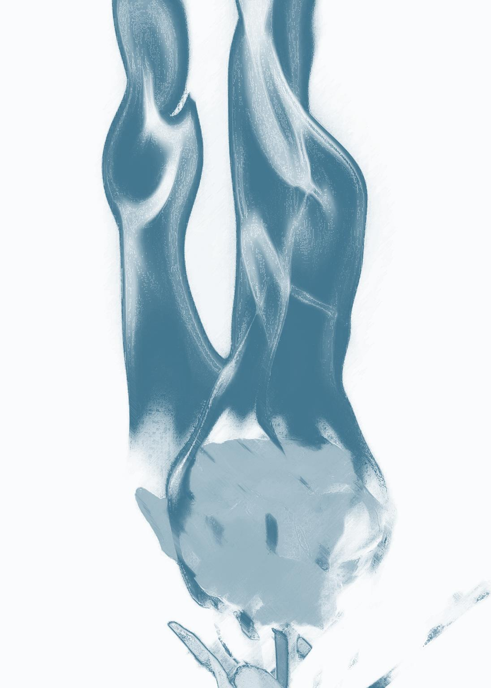

#伊罗 #刀 #第二人称 #角色死亡 

你已死。我活着。

还有世界，还有晨曦。

他们都死了。或迟或早，终局将至，这是命运宣读的审判，无人能逃脱。这也是最后的安慰，失败者的安慰，毫无甜蜜的安慰。你设想过很多次，不无恶意和激情。他们都会死，所有人类，所有卑劣的掠夺者，所有沉默的顺从者，所有麻木的怯懦者，所有虚伪的阴谋家，所有愚蠢的刽子手，所有有罪的无辜的残暴的纯真的，他们通通都会去死。

而你会比所有人都活得更久，带着迟来的苦涩胜利。那时你还是自己吗？你曾无数遍问过。答案早已写下，我们已经是怪物了。

他们会死的，你一遍遍对自己重复，在无法闭上眼睛的夜晚，站在同伴惨死的血泊中，看向烈火灼烧的人类村庄，如默诵咒语。你的希望来自于亲手割掉的每一颗头，来自于通缉令上不断攀升的悬赏额，来自于别人提起你的名字时毫不掩饰的厌恶和抑制不住的恐惧。

我们早就是怪物了。

你说不清谁更绝望，是活得更久但一无所有的精灵，还是命若飘蓬却占有世界的人类。你只知道那些如秃鹫一般贪婪的如豺狼一样残暴的如毒蛇一般狡诈的必须得付出代价。所有他们送给过你们的讥笑、轻蔑、屈辱与不公，你都必将用鲜血如数奉还。

既然命运从不曾公正，既然祈求只会带来失望，既然和谈的结局唯有羞辱，既然信任将以欺骗交付，于是你必亲手拿回正义。

他们必须得死。

你要把他们对你们做过的事情通通再做一遍。

你见过贫民窟中的精灵，你的同类，你看不清他们的眼睛，像宝石一般闪耀的各色眼珠里只剩麻木与灰暗。绝望攫住他们，恐惧渗透并压垮了每一个曾经自由的灵魂。他们的喉咙里已经一点声音都发不出来了，缄默不语，苟延残喘，这哪能称之为生活？胆颤心惊，每时每刻如惊弓之鸟；毫无尊严，被人类的法律操弄致死。你想要找到一丝同情，抑或悲悯，但你做不到。我们早就是怪物了。他们是牲畜，你对自己说，你简直不明白，他们怎么能忍受那样的日子，被毫无缘由地逮捕、定罪、羞辱、虐待，全身心地蒙受人类的侮辱，连最微弱的反抗也忘了。

你永远都不会过那样的日子，把自由和自尊交给人类蹂躏。所以你在战斗，整整一个世纪，没有什么能让你放下手中的箭，到后来，你如此冷静地明白自己需要鲜血和死亡，斗争的尽头是什么？你已经回不去了。

你在毫不回头地向死亡行进。

没关系，他们都会死的，没关系。尽管他们会在死之前毁灭你的所有希望，你被迫承受来自人类的羞辱，头巾下的伤疤像一记响亮的耳光。你空洞的右眼里是什么？空无，仅此而已。

你会和这个沦为焦土的世界一起走向毁灭。

亲爱的，我们早已经都是怪物了。

谁会是下一个牺牲品？你在黑暗中寻觅，两手空空。消息第一次传来的时候，甚至都搞不清它究竟是真是假，你想，如此倔强的人怎么会如此轻飘飘地就死了，直到细节越来越清晰明了，言语开始拼凑事实，他的死被一点点构筑出来：爱国者的悲剧在空戏院上演，许多柄剑割开冷硬如铁的身体。

你设想过很多次他的结局，一如回忆自己，而他走向了最合乎情理的一种。_爱国者的悲剧。_昨天的他就是今天的你，今天的你就是明天的他。

谁想在这个世界保留他之所爱，就得献上全部。

许久以来，生活还剩什么？睁开眼睛、逃避死亡、啜饮露水、啃噬果实、肢解生命、东躲西藏。词语萦绕，无休无止，自由、复仇 、希望、饥饿、尊严、斗争、伙伴、往昔。

你还期待什么？结局。

属于你的一切都与你如影随形。战争。奴役。监狱。刀子。拳头。冷箭。高烧。瘟疫。屠宰。蹂躏。人类，这些集体走向地狱的人。

你是什么？死亡。

火焰灼烧之地，秃鹫聚集之地。精灵的灵魂被困在那里，失去尊严的肉身在人类嗤笑的目光中腐烂。我从废墟之中爬出，心里不再呼唤故乡的名字，我将从死亡之地带来死亡。

你制造什么？杀戮。

为一个不存在的理想而战，为幽灵般的回忆而战，为了自由与尊严，为了无人能理解的至高无上的一切，为了我存在的全部意义。我将延续所有仇恨，直至终结。

你在找寻什么？自由。

精灵曾是自由的风。我们流浪的灵魂穿过生命，弹琴、歌唱、编织发辫，他们谈起过去，眼睛里全是故乡的晴空，可故乡在哪，何以为家？梦幻，还不如梦幻，轻烟而已。

你渴望什么？安宁。

笛声如潮汐，我还活着，我将活着。太阳、溪流、叶子、花露、食物、温暖、诗歌、爱，我还不是怪物，我只是需要复仇。我今天又杀了多少人？

你在哪里？火与血，友与仇。

我已经无法逃脱了。

你还记得第一次见他的样子，_这世上的混蛋又多了一个。_可他不是混蛋，他是和你一样的怪物，看着他的眼睛，你明白，他也需要鲜血与杀戮。温热的血溅在脸上，冰冷的眼眸互相凝视，全世界唯剩扑通扑通的心跳，黏稠的鲜血从指尖渗入皮肤，包裹整个灵魂，你存在，你找不到别的方式存在。

他比你走得还远。他正是你恐惧的样子。他享受制造痛苦，放任非人性的欲望吞噬自己，冷静异常，就好像生来内心便空无一物，没有回忆可以依靠，也没有未来可以指望。这正是你们的样子，两个怪物，只会杀人，靠掠夺和仇恨而生。

你们是世界上最适合彼此的两个生物。

他毫无愧疚、毫不犹豫地杀掉了许许多多的精灵，也用最残忍的手段把你的兄弟折磨致死，你了解那些词语，恐怖的内涵藏在无害的拼写之后：钉床、轮刑、断椎、肉钳、血鹰。你恨他，他是这世上最该死的人类，所以你无比渴望杀死弗尔泰斯特，你要把他珍视的一切通通拿走，你想看着他尖叫、痛哭、摇摇欲坠，然后变成废墟，毫无指望地沉入地狱。你想让他明白一个道理：世界从不对任何人仁慈，我们将带着仇恨永无止境地沉沦。

你要把他变得同你一样绝望，就像你正慢慢变得和他一样漠然。

你要毁灭他渴望的一切。

弗尔泰斯特死后，恶毒的欲念渐渐成真，你知道弗农崩溃了，尽管他面上的表情仍旧是别无二致的冷淡。他在坍塌，只要再多一点点努力，你就能看见他和你一起堕落。可快意后是极致的空虚。说到底，国王和乞丐于你有何区别？人类又少了一个。杀戮还在持续。

飞瀑草绽放在灵魂之月，森林里的瀑布下开着无人知晓的思念，花朵是被包裹的烈焰，千千万万朵小花攀在石头上，仿佛地火在冰里灼烧。

那你是唯一想送给他的植物。他配不上百合的纯白，也配不上玫瑰的浓烈，更配不上苹果花的安宁，他同你一样，只是死亡，只是冰冷的火，只是余烬。

飞瀑草，谁也找不到的飞瀑草，谁也无法理解的爱。无人聆听的情感，无法跨越的界限。

_我们是这疯狂世界上最后的同类，我亲爱的怪物伙伴。_

森林里相遇的时候，你知道这或许就是故事的终局，他不明白的一切和你无法言说的一切。像所有应当发生的故事那样，你们很快厮打起来，就像两头野兽互相搏杀。先是剑，然后是拳头，最后是牙齿，你们竭尽全力，很快身上都是青紫的瘀伤，但没关系，赢的是你，正如活到最后的也将是你。

你看着他棕色的眼睛，什么也读不出来。你不明白自己在找寻什么，但你知道你要找的东西不在那双眼睛里。

他割开了指挥官的链甲。

性器强行塞进去的时候，他们都恶心地想吐。他看见罗契的脸开始颤抖，棕色的眼睛错愕地睁大，不知道是出于愤怒还是屈辱。他死死地按住男人不停挣扎的肩，像按住一尾脱水的鱼，窒息感在蔓延，伊欧菲斯费了很大劲儿才重新把阴茎塞进罗契的屁股里。

_一点快感都没有。_

_他一定没想到自己会被这么折辱。_ 伊欧菲斯努力寻找最刁钻的角度，深深钉进罗契的身体，他仍旧很想吐。他憎恨的人在身下喘息，不住地想打他，他扇了罗契两巴掌，看见鼻血从那张固执的脸流进肮脏的黑土。伊欧菲斯盯着自己的手，滚烫的触感留在那里，他感到无比卑劣，无比恶心，这是双重的背叛，既背叛了他的兄弟，也背叛了他自己。

他为什么要和自己的所恨之人有肌肤之亲？_因为他爱他。_

他为什么要这么对待自己所爱之人？_因为他想要他死。_

罗契还在挣扎，他拒绝接受这种屈辱，伊欧菲斯的阴茎比任何酷刑都更让他无法接受。这并不是很痛，远比他在战争中得到的东西要好，但它内部的某些东西让人厌烦，荒诞的现实带着一丝滑稽，甚至让罗契有点想笑。那个精灵做得很认真，他的性器在自己的体内膨胀，兴奋地跳动，带着折辱之外的东西，他不懂，也不想懂。

_你在做什么？**强奸，**_ 伊欧菲斯想，_就像人类数百年来对精灵做的那样，拿走他们的自尊，用恐惧压垮他们，只留下屈辱。_

但他做不到，他没法在弗农身上种下恐惧，如同那束小草，如同他的梦，错综复杂、互相矛盾的希望从未实现过。他想要他死，他想要他痛苦，他想要他品尝到同他一样的屈辱和桎梏，他想要人类付出代价，他想要自由，他想要他的回应，他想要重新成为自己，他还梦想着爱。

他特意把碾磨的动作拉得很漫长，羞辱他也是羞辱自己，阴茎激烈地挺送，鲜血从交合处流出，带回无休无止纠缠着的记忆，他想起了被罗契割下的精灵头颅，他们的眼睛合不上 …… 伊欧菲斯看向自己的胸前，留恋般地摸了摸闪闪发光的三枚徽章，拔出了从不离身的匕首。

第一刀割下去的时候，他并未感受到多少快感，呕吐的欲望还在那里，甚至更加强烈，鲜血从青紫交加的身体喷薄而出，他多多少少找到了一点安慰。

“ 如果我是你，我的手就不会颤抖。 ” 身下的人嗤笑一声，语气仍然很冷静。

“ 亲爱的，你是疯子，可我不是。 ” 伊欧菲斯努力使自己的语气显得同样冷静，他不想在这场较量中率先丢盔弃甲。身下的人眼神冷漠，他想听罗契骂他，用最恶毒的语言和最憎恶的眼神，可他们太了解彼此了，他不会让他爽到。

罗契古怪地笑了一声，“这就是你在上我的原因？说真的，伊欧菲斯，你的确不是疯子。”

他握着匕首，性的欲望蓦然停滞，伤害和毁灭的渴求在身体内涌动，最后促使着双手又毫不颤抖地割下一刀，伤口落在背部正中央，他想看见白森森的骨。伊欧菲斯顿了一下，几乎是自暴自弃，“我爱你，你知道吗？”_我听起来一定很滑稽_，但他不在乎，他缓慢又精准地一刀刀割下去，看鲜血从每个肿胀的伤口绽放，溅落到原野四周，就像燃烧的烈焰，一点点包裹住他们 —— 用身体点燃的火焰。

_越来越想吐，我变成怪物了。_

罗契的脸变得毫无表情，不是麻木和倦怠，仅仅只是不感兴趣。这一切都很没意思，他的灵魂潜藏回空无之中，折磨和虐待再不能激起一丝反馈，甚至连呻吟都没有一声，那双冰冷的棕色眼睛看向伊欧菲斯，一旦跨过那条界限，什么都变了。身体互相缠绕，像最亲密的恋人，而流淌在他们之间的，并非温情脉脉的爱意，而是漫长岁月带来的鲜血和无法消弭的仇恨。

伊欧菲斯不停地想着那束石头上的小草，_一段隐秘的、无人知晓的爱。_他挺送着腰，呕吐的欲望一阵阵撞击着他，他想自己也没比罗契好受到哪去。_没有意义的爱。_他的阴茎在往罗契的身体里钻，一下比一下插得更用力，_他杀死了我那么多弟兄。_他的手再也不曾颤抖，刀锋划开的皮肤像是春天里颤抖的玫瑰花瓣。_他是刽子手。他该死。_血肉在他的眼前被翻起，有玫瑰花瓣飘落如雨，到处都是血，罗契的身体被他打开，无论是里面还是外面。

_我爱他，我的爱人在流血。_

“ 这就是你想要的吗？ ” 罗契看向伊欧菲斯，皱着眉问道。

他逃避般地扭开了头。_你是唯一能理解我的人，你是唯一我想拯救的人。_

“ 你知道你会得到什么吗？ ” 伊欧菲斯喘了口气，像承受不住一般远远抛开匕首。他抹了一把手上的血，将它们涂到唇边。

罗契没有理会他。他的性器还死死地插在身下之人的体内。

“ 我们远比其他人更相似。 ” 伊欧菲斯喃喃自语，_所以你该理解我的，你该明白我有多想让你去死的，你也该理解我有多想让你不再坠落的。_

“ 所以我希望你去死。 ” 罗契的声音比他想象得还冷淡。他仍旧想听他骂他。

“ 我会死，但不是现在。人类，我会比你活得久得多，今天的我就是明天的你，亲爱的，不过你本来就是疯子。 ” 伊欧菲斯拔出自己的阴茎，换了个角度重新插进去， “ 你知道等着你的会是什么吗？你深爱的国家会被撕个粉碎，谁知道那些居心叵测的人会对弗尔泰斯特留下的一双儿女干什么呢？你想要守护他们，对不对？你守不住的，你保护不了的国王，你也保护不了你的国家。你知道泰莫利亚的命运会是什么吗？仰人鼻息、小心翼翼、丧失自尊，你们这群泰莫利亚的混球会被毫无缘由地定罪、通缉、逮捕，最后像垃圾一样死在脏乱不堪的小巷。 ”

罗契瞪着他，再次一言不发，伊欧菲斯舔了舔唇，满意地尝到一股血味，呕吐的欲望在消退，性欲回来了，他开始兴奋。

“ 是啊，这就是我期待的，我喜欢这么对待你，就像你对待我们一样。我爱你，混蛋，我们一起去地狱吧。 ” 他补充道，心想罗契一定懂。_我会杀了你，我想要血，我想看你苦痛不堪，我想看你像狗一样被人虐待，我会夺走你的所有希望，我要伤害你，我要毁灭你，我要复仇，我要让整个世界开始燃烧，我已经找不回我想要的东西了，我已经不是自己了。这残暴不堪的灵魂，这沾满血腥的双手，这遭人唾弃的名字，这千疮百孔的身体，这是我亲自选择的命运。我不想变成那样。我想爱你，我想你爱我，我想杀了你，我想拯救你。_

“ 你靠什么而活？ ” 他翠绿色的眼睛开始烧灼，罗契无比明白那束火光，他的心里也有一样的东西，随弗尔泰斯特的死越发灿烈。他们亲手为彼此织就了一座地狱，以眼还眼，以牙还牙，这很公平，复仇，抑或毁灭。

“ 蔑视。 ” 他停顿了一瞬，缓慢地回答。笛声回荡在耳边，伊欧菲斯思考了一瞬死亡。

_现在还不是时候。_

你很久没有听过那个名字了。你的斥候们带着轻松谈起他的死，绘声绘色，乍一听满是大仇得报后的快意，实际上却是疲惫的漠不关心。在尼弗迦德面前，你们早就不是彼此最关心的威胁了。你们都有更为崇高的目标需要为之奋斗，连为彼此而设的疯狂仇恨在那目标面前都不值一提。你的心里泛起一股奇怪的抽搐，就像有人往湖里投了几颗小石子，阵阵涟漪扩散开来，慢慢归于沉寂无声。心兽在彷徨地呐喊，话题很快被揭过去，有太多比往昔的敌人更重要的事了，哪怕是眼前静静飘零的叶子。你才恍然意识到你们已经三年没见过面，森林的那次即是永别。你不知道他是怎么带着被你弄得乱七八糟的身体回去，然后继续战斗的；你不知道他会不会在无人的深夜里想起你，就像想起一段遥远的过去；你也不知道他是否也在森林深处邂逅过开在寒冰里的火焰。他死了，你在这世界上最后的一个同类死了。死于可笑的希望，你知道，这也会是你的某种结局，你们以相同的某种方式坠落，终究会以某种相似的方式飞翔。

他的死改变不了任何东西，这世界仍旧毫无指望地堕落着。就像你坚称的那样，国王与乞丐于你并无区别，他也没有。

你知道故事的另一种结局吗？飞瀑草只能在人迹罕至的地方隐秘生长，无人能看见它们真实的样子。它们开在界限之外，渴望无穷无尽。

这就是故事唯一的结局。

END