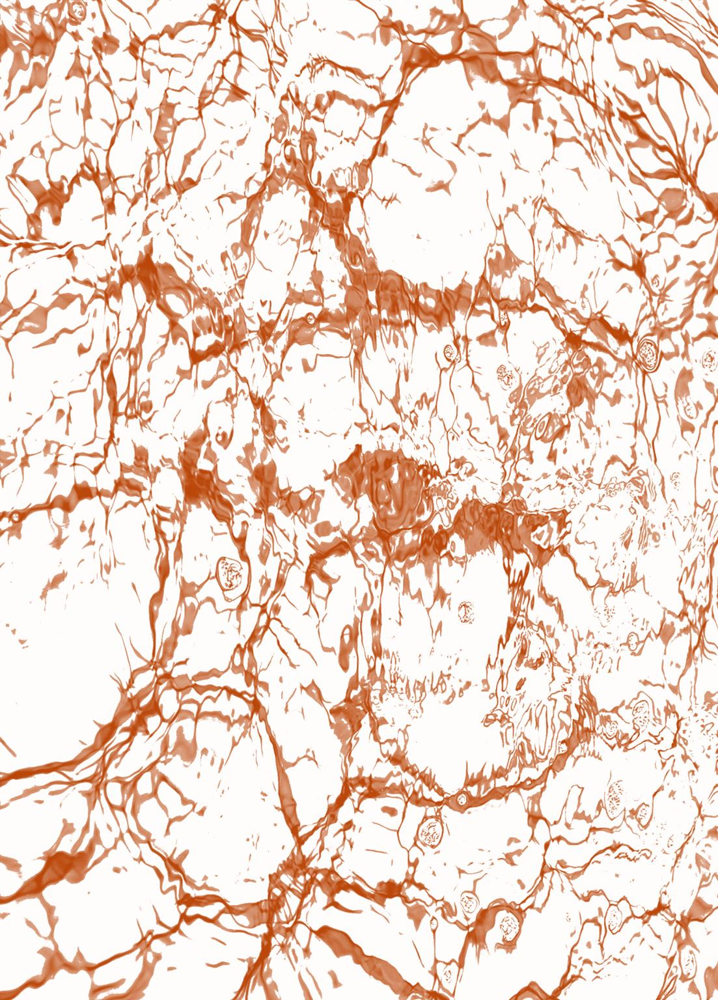

#第三人称 #蛇罗 #黄文 #伊罗 #蛇狼

我生活，我杀戮，  
我行使毁灭者的无限权力。

——献给NEO老师。

## 正文

月光下他的眼睛像一把利刃。

罗契紧握着剑，独特的金色眸子在森林里一闪而过，他追逐这双眼睛而来。仅仅只思考了一瞬，愤怒和焦灼便迫使他放弃了所有谨慎和预先计划——他不能放弃这次机会，他不能继续在浮巷如无头苍蝇一样乱晃了。所以他撇下杰洛特，躲过诸多陷阱，顺着泥泞曲折的小路，紧紧跟随对方迅速又毫不犹豫的身影，在森林里绕来绕去。

停下的时候，罗契才发现自己站在了一片被山谷掩映的空地中，远处是弥漫的雾气，月光也刺不透这层薄纱。这里看起来相当隐蔽，埋伏在森林里的蓝衣铁卫显然赶不及也找不到。但他不在乎，罗契认为自己即将得到某些真相，如果运气好的话，还能让弑王者血债血偿。

那人好整以暇地坐在一块高处山坡的石头上，手里把玩着纤长的匕首，刀锋在月光下闪出冰冷的银辉，如果不是那片冷冽的寒光，他几乎就要和岩石融为一体。罗契知道猎魔人的感官都很灵敏，对方也显然察觉了他的存在。但他还是谨慎地挪着步子，试图悄悄接近弑王者。

他的心脏开始剧烈跳动，罗契不确定自己有几分胜算。他和杰洛特打过几次拳，明白猎魔人的力气和技巧有多可怕，而眼前这个猎魔人看起来远比杰洛特还要壮硕危险。他想起弗尔泰斯特脖子上的创口，冷凝地盯着猎魔人背上隐没在黑暗中的剑。

猎魔人漫不经心地抬起眼睛，金色的猫瞳闪着光，他从岩石上一跃而下，落地很稳，几乎不需要靠下蹲来缓冲。罗契听着沉闷的响声，慢慢计算出剑的角度。

冽冽寒风开始进入山谷，吹散了弥漫的雾气。

月光帮他勾勒出了那人的轮廓，看起来比在黑暗中更壮硕，几乎是罗契平生所见之最。铠甲很薄，青筋暴起的双臂裸露在外，虬劲的肌肉挤成一团，罗契想对方就是用这双手臂杀死弗尔泰斯特的。他的脸看起来有些呆愣，表情迟缓内敛，只有那双金色的猫眼残忍又锋利。他的脖子上吊着和杰洛特如出一辙的挂坠，在月光下闪着幽光，上面刻着一条盘曲的长蛇。

“弗农·罗契，泰莫利亚蓝衣铁卫的指挥官。我等你很久了。”对方的声音冰冷、黏腻又缓慢——尽管他们都面无表情，但罗契明白那个男人平静无波的脸上也是明晃晃的厌恶和憎恨——真的像是蛇在爬行。

“你是？”手中的剑蓄势待发，他观察着男人的站姿和肌肉的紧绷程度，罗契认为自己已经足够礼貌——对付猎魔人总是需要格外谨慎。

“古勒塔的雷索。”罗契完全搞不明白这人是谁，又为什么要刺杀国王。_现在，我得到了一个名字。_他的肌肉愈发紧绷，如同一头蓄势待发的花豹。

雷索扯出一个难看的笑意，像是毒蛇猛地露出尖牙。月光下他的眼睛冰冷而闪耀。

随后男人冲了上来，他的动作灵敏得不可思议，罗契勉强招架了几招，发现雷索的力气比杰洛特还大。他艰难地抵挡住男人的进攻，对方的剑招沉重却轻灵，很快他的剑便被打飞出去，雷索踢了他一脚。罗契翻滚几圈，半跪在地上拔出短剑试图继续战斗。

还没等他站起身，雷索再次踹了他一脚。他被迫趴在地上，鼻尖抵着泥土，一股腥甜从喉头涌上，他想自己的身体内部正在流血。罗契翻过身，努力撑起自己，冷冷地瞪着雷索。

“你在利用杰洛特。”雷索的语气很笃定。他看着眼前双手撑在地上的男人，眼神厌恶又嘲弄。

“你也在利用伊欧菲斯。”罗契盯着男人健壮的脸，让自己的语气显得淡漠又轻蔑。

“这不一样。”雷索扯出一个讥诮的笑，“杰洛特可不是伊欧菲斯。”

“你们那些可悲的小主意不可能成功的。”罗契开始怒吼，弗尔泰斯特扭曲的脸和雷索金色的猫瞳重叠，他真想立刻拿起剑宰了这个畜牲。可悲的是，他们可悲的小主意已经在他的王身上成功了。而他可悲地倒在这里，即将成为下一个牺牲品。他不后悔自己的冲动，只后悔自己的无能，一贯有之的无能。

“现在你应该担心一下自己，人类。”雷索踢上罗契撑住地面的手臂，满意地看着对方再次倒在潮湿的泥土里。那双倔强的眼睛被一瞬间的剧痛撑大，随后是迷茫和愣怔，很快罗契发出一声急促的喊叫，眼睛里再次充满愤怒。

他抬起脚，重重地碾在罗契的左手上。

“我可不希望他变成你的士兵男孩。这事本来可以和他无关的。可惜他要为了你追杀我。”罗契咬着牙，他的脸开始抽搐，左手传来持续不断的碎裂般的阵痛，猎魔人一直在践踏那里，并且碾得很用力。

“杰洛特背着弑王者的骂名，他必须这么做。”他抽着气，努力忽视左手上传来的剧烈痛苦。雷索的影子笼罩着他，是他人生中的停伫的一片乌云抑或噩梦。

“那是你让他相信他必须那么做。”雷索又踹了罗契一脚，“事实上他已经厌倦了，不是吗？他只想找回他的记忆。”

罗契不知道雷索是怎么得知这一切的，那场对话只有他们俩在场。杰洛特的确早已厌倦了这一切，猎魔人对政治的厌烦和嘲弄有目共睹，对战争也是一种近乎超脱般的态度，他丝毫不信有关任何荣耀和责任的鬼话，_他只在乎他自己，和他所爱之人。_罗契说服杰洛特留下的理由只有一个：洗刷弑王者的罪名。但杰洛特终究只想找回自己的记忆。

雷索抱着双臂，冷漠地俯视表情倔强的罗契，满意地打量着他紧抿的嘴唇和因痛苦而颤抖的脸，沉重的脚还停在男人半露在外的手指上，丝毫没有离开的意思。罗契的视线开始变得模糊，他急促地呼吸着，仿佛蛇的冰冷鳞片正紧贴着脖子，阻止空气进入肺部。他的身体在一股巨力下不断沉落，被碾碎成泥土，慢慢腐烂，和不计其数的死尸融为一体。

乌云遮住明月，雷索的脸藏在一片阴影中，没有什么能窥探他此时的表情，“他一直都不想当弗尔泰斯特的士兵，可这个世界逼着他这么干。现在，一切都变得复杂了。”紧接着他叹了口气，大局在握语气变得很哀伤，“他一直说猎魔人是不参与政治的，现在却要为一个国王追杀我。而你乐于见到这一切。”

“你杀了弗尔泰斯特——”罗契开始大喊，愤怒和厌恶迫使他这么做。他清楚地听到了自己骨头一点点变形、开裂、破碎的声音，断裂的声音在寂静的夜里绽开，也在他的身体内部传递。他再一次陷入了无能为力，_他什么都做不到，什么都改变不了，除了怒骂，除了大喊大叫。_

“真好笑，你们一起为死人寻求公正。”雷索对那几根已经无法动弹的手指失去了兴趣，开始不停踢打他的左臂，缓慢又精确，他想自己身体内一定满是细碎的骨渣。

“那你又在为谁而战？”罗契努力使自己的语气显得嘲弄。他在等待身体上的疼痛过去，_一切都会结束的，_他对自己说，现在，_要做的是忍耐。_

雷索的回答不无轻蔑，“我们为自己而战。”

罗契的脸滑稽地扭曲起来，一半是因为痛，一半是出于想要大笑的欲望。一个猎魔人从怪物杀人变成国王杀手，他怎么可能还在为自己而战？

雷索注视着月光下罗契嘲弄又怜悯的眼神，缓慢地笑了笑，他的脸向着月光的方向扬起，凝视着很远很远的地方，“自然，像你这样的走狗永远也不会理解。弗尔泰斯特的链子紧紧勒住了你的脖子。就连他死了也一样。”

他停顿了一会，接着又像想起来什么似的：“你还不知道弗尔泰斯特是怎么死的吧？我想你追到这里就是为了这个。”雷索蹲在罗契身前，饶有兴趣地看着他扭曲的脸，那双猫瞳里没有任何情感，只一片淡漠的凝视，罗契找不到一丝仇恨或是得意。他突然意识到雷索是故意将他引到这里来的——罗契一向喜欢目的明确的敌人，而猎魔人的目的扑朔迷离。被踩过的左手一阵阵抽搐着，实际上，那些手指根本动弹不得。左臂传来细碎又凌乱的痛楚，他想那里应该是骨折了，雷索踢地很用力。

“我杀了你的国王。”猎魔人的语气很平静，不带任何起伏，每个字都念得慢吞吞的，依旧迟缓黏腻。雷索绕到罗契身前，看着他被怒火烧灼的双眼，笑得很懒散，“他死得很痛苦。”

罗契的脸紧贴着肮脏的泥土，几株草叶在高高悬挂的月亮下闪着冰冷的光，剧烈的疼痛迫使他喘着粗气，睁大双眼，唇上尝到露水甘洌的味道。寒意透过静谧的大地顺着他的身体上升，仿佛有蛇在尾椎爬行。他意识到等待自己的绝不仅仅只是一个故事——尽管这是他一直在追寻的真相。

他看见猎魔人站起身，随后，一股剧痛从胫骨传来，他的思绪断裂了一瞬，然后意识到那是雷索在折断他的小腿。“我割开了他的喉咙。不像德马维，弗尔泰斯特挣扎了一会才断气，他应该会被自己的血呛到吧。”猎魔人再一次笑起来，仿佛这个场景给他带来了单纯的快乐。那双金色的眼睛和杰洛特截然不同，它们冰冷又残忍，如同闪闪发光的金属刀刃。雷索的语气简单直接，每个词的尾音都咬得很重，就像在宣读审判。

“你真是个婊子养的。”剧烈的疼痛让罗契的语气断断续续，雷索又笑了起来，这次是发自内心的愉悦。

“真有趣，你也这么骂伊欧菲斯，是你以前的经历让你想不出比这更强烈的羞辱吗？”他踢了一下罗契的小腿，漫不经心地看着它折成一个不正常的角度。

“你怎么不讲故事了？我更关心你为什么要杀弗尔泰斯特。”罗契闭上眼睛，试图平息烧灼的血液，他想重新控制身体，让他能站起来继续和猎魔人对峙，但他什么都做不到，他的手臂甚至没有力气让他能撑起自己。

“因为我们为自己而战。”雷索再一次耐心重复。罗契觉得雷索笑得很傲慢，尽管那张脸看起来面无表情，甚至有些呆愣。“耐心点，指挥官，我会让你这辈子都忘不掉这个故事的。”

罗契啐了一口，“杀人凶手。”他怒骂起来，嗓音因为疼痛和脱力变得嘶哑。

雷索打量着罗契扭曲成一团的脸，不轻不重地踩在他的肚子上，一股绝望的压迫感从腹部传来。罗契开始憎恨自己的身体，它们变得恐惧而哀伤，几乎每个人都会被痛苦弄得破破烂烂，他一直熟知这项准则，并把它视为一种工作态度。现在，他要学着去战胜身体内部传来的虚无和疲惫。雷索的重量压在他的内脏上，脚尖翻来覆去地戳那块肉，就像在翻弄什么货物。“伊欧菲斯告诉我了很多关于你的事。”随后又慢条斯理地补充道，“真是条好狗。”

罗契瞪视着猎魔人，这是他现在唯一可以干的事情。眼眶变得干涩，汗水和剧痛模糊了他的视线，他已经看不清这个月夜和猎魔人了。他一直在尝试，但是左手已经完全没法动弹，那个器官就像已经不属于他了一样，失去了灵敏和坚定，只留下雷索带来的剧痛。他想着自己腰带上绑着的匕首和口袋里的几把飞刀，祈祷雷索不要对他的右手感兴趣。

雷索的叙述还在继续，伴随着小腿上剧烈的痛苦，心里的哀恸也开始蔓延。他想要雷索停下，但他又想知道那时候的事情……他只是需要一个更加温柔或者满怀敬意的口吻，让他可以亲眼看见那一幕，和他的国王一起迎接荒诞的寂静。

可他遇到的是弑王者。他现在才明白，绝望是没有尽头的，他的想象力不及事实万分之一残酷。

“本来我是应该割掉他的头的。杰洛特毁了一切，不过我切开的创口很深，他倒在地上的时候眼睛都合不上。”_弗尔泰斯特独自面对死亡时会是什么感受呢，他会比我现在更痛苦吗？那些他没来得及做的事情就这样结束了。我被独自留在了这里，我的陛下，您在那里会感到孤独吗？_

“如果再用力一点，现在你就可以看见他的头颅了。”_如此屈辱而无力的我，不想被那双眼睛看见。_

“从他的眼睛里我可以看见恐惧。伊欧菲斯说得对，就你们人类而言，乞丐和国王也没有任何区别。”_他是我高贵而美丽的王，他死在你卑劣的匕首下。_

“说不出话了吗？我还以为你很擅长对付疼痛。”雷索踢着罗契的腰侧，欣赏着对方咬牙忍耐的样子。

罗契闭上眼睛，不再挣扎，只是集中精力想着自己的匕首和飞刀。

“那个被你折磨的刺客也是我的同伴。相信我，我会让你比他更痛苦。”雷索俯视着地上的男人，他亲手毁灭了他的信仰和希望。但他仍在战斗，不惜拉着所有人陪他一起下地狱。他们都是国王棋局上的棋子，随时会被推出去成为新的牺牲品。雷索不再去看蜷成一团的罗契，他将视线投向月亮，在更远的南方，也有他孤注一掷要寻回的东西。所以他将延续毫无意义的杀戮和争斗，直至国王分出胜负，直至棋局终了，直至这个世界走向尽头。他眺望极远极远的天际，冷漠地想着等待自己的将会是什么，随后低头看了一眼身下伤痕累累的男人，感到一阵残酷的快感。_他们都会死的，他对自己说，我们将为自由而战。_

_没有谁能利用我们，除了希望和爱。_他的脑海中浮现出杰洛特温暖明亮的猫瞳，他们拥有相似的眼睛，彼此命运交织，自从相遇后，那双眼睛便镌刻在他的记忆中。他习惯在那样的目光下生活，就像刚刚钻出雪地，冰冷融化在春光中一样，他变得愉悦、散漫、自由自在。那双眼睛温柔又放纵，让他回忆起信任和陪伴的美妙。他和他的兄弟们，都喜欢那个有些愤世嫉俗的男人，他的柔情和耐心隐藏在冷漠和讥诮之下，他喜欢他们一起生活的时光。_可我拥有了新的目的地。我找回了逸散的希望。而你不告而别，踏上了截然相反的路。_

“你的腿骨应该碎了吧。”他赶走挥之不去的记忆，欣赏一会罗契略带紧张的表情，低低笑起来，“放心，我不会动你的右手。”

得益于刚刚和猎魔人并不友好的交流，罗契开始恐惧于这句话里暗藏的残忍。痛苦就是这样，一种无人能超越的东西。

“弗尔泰斯特从未想过帮你隐瞒什么。所有人都知道，你是条好狗。”雷索看着他摇头，“你想把杰洛特也变成你这种可悲的模样。那个笨蛋总是跟着你。”

猎魔人扯着他的头发，将他强行从泥土里拖起来，手指捏住他的下巴，迫使他张开嘴，随后一股剧痛传来，他明白那是猎魔人卸掉了他的下巴，罗契不明白雷索想干什么，“你最好不要耍些什么小动作，实际上我也可以打断你的牙。”他留下了一句冰冷的威胁。

罗契开始明白了。

硕大的性器塞进他的口腔，腥味很浓厚，开始只是浅浅的前端，只进入了一点点，在他的嘴唇和舌苔中间来回摩擦。他的舌尖扫过那里，舔到一些渗出液体，感到一阵不可抑制的恶心。他总结着正在发生的事情——他正屈辱地跪在地上，给一个男人口交，他成了一个婊子。

雷索又插进去一点，性器压在他的舌头上，开始顶弄他的喉管。口腔被撑得很大，脱臼的下巴传来一阵阵撕裂的剧痛，进出的时候他的牙齿会擦过对方的阴茎，罗契想要闭上嘴，狠狠咬下去，但那些骨头从未有过的软弱无力。

他脸上的肌肉疼得要死，不停地抽搐着，他想把那玩意吐出来。雷索的阴茎就像毒蛇一样，在他的身体内恶毒地游动。

“舔。”雷索冷漠的声音响起，他诧异地看了对方一眼，像是仍然对自己正在遭受的侮辱不可置信。

雷索居高临下地看着他灼烧的眼睛，语气变得无所谓：“你不愿意吗？那吞下去吧。”

巨大的阴影笼罩住罗契，和那个猎魔人健壮的身体比起来，他几乎显得有些纤弱。

罗契绝望地发现雷索开始往更深的地方戳刺，他的口腔被撑得更大，几丝含不住的涎液顺着嘴角流下，晕染在蓝衣上。他的喉咙火辣辣地疼，喉管一阵阵收缩，想要挤压出本不该存在的异物。雷索残忍地深入，阴茎磨破了他的喉咙，性器在他的身体内部跳动，带来阵阵火烧火燎的疼痛。

他想吐，生理上的条件反射和心理上的厌恶让他无比恶心，但他只能绝望地张大嘴，流下混杂着血丝的唾液。他发出了几声干呕，就像动物绝望地哀嚎，雷索不管不顾地深入，每一次摩擦都让他自觉更加污秽。

“你的技巧很糟糕。”雷索的语气就像在评价一个婊子。“你应该舔舔它的，会让你也舒服点。”

但他被压住的舌头也很疼。罗契和自己内心的屈辱对峙了一会，渐渐开始配合，从雷索进来的时候开始舔阴茎的前端，然后随着对方的节奏慢慢舔舐剩下的部分，这确实让他好受了一点，他的喉咙不再是一种被撕裂的痛感，转而变成了一种漫长的瘙痒和粗粝的疼痛。

被人使用的感觉让他感到绝望般的肮脏和厌恶。

脸上的肌肉越来越僵硬，他的嘴里满是铁锈味和性器的腥味，他一边干呕一边艰难地移动着舌头，雷索的阴茎在他的喉咙里跳动，随后，猎魔人扯住他的头发，抽出性器，射在罗契的脸上。

罗契倒在草地上，咳出一大口鲜血，白色的精液染得到处都是，他的几绺头发被沾湿，黏在脸上，鼻腔里只剩下了精液的腥味。

他咳了很久，像是要把灵魂从身体里吐出去，但那些肮脏的东西已经变成了一条蛇，在他的内脏中游弋，他被困在这里，成了供人发泄的器具。

“屈辱吗？抱歉把你弄得不能说话了。”雷索捡起被他丢开的长剑，划破了指挥官的链甲，“接下来你也没什么穿衣服的必要了。”

罗契匆匆抓住右手边的锤子，猎魔人的速度比他想象得更快，他还没来得及做出什么有效的反击，雷索便已扼住他的手，把他身上的衣服和武器统统扔了出去。然后掰开了他的双腿。

“看来你很喜欢你的武器。”雷索打量了一会草地上散落的各种物什，最后还是拿起了那把泰莫利亚制式的长剑。

一股莫大的冰寒和堵塞感从尾椎升起，_那个混蛋把我的剑插进了我的后穴里，_罗契意识到了雷索在干的事情。他的剑柄并不算很粗，剑墩碾磨着肠道，最粗大的部分卡在肠壁中间，剑茎上的纹饰剐蹭着柔软的肉，雷索恶意地推着剑柄，“想看看你的屁股能吃下多少吗？”

他右手抓住草叶，挣扎着想向前爬。

雷索踩住他的腿，扼住男人逃离的微弱可能，恶意地不停用剑柄捅那个狭小的穴口。

罗契只能忍受剑墩撞击肠肉带来的痛苦和耻辱。他的挣扎越发微弱，雷索冷冷地拔出剑，远远丢出去。随后塞入自己的阴茎。

罗契低垂着眼睛，不愿思考自己身上正在发生的事情。他的脸紧挨着一片乱七八糟的液体，他想有些已经渗入他的皮肤里了。他很确定里面大部分都是自己的血，至于其他的成分，他不是很想关心。浓重的腥味和铁锈味萦绕在鼻尖，让他觉得头昏脑胀。雷索的性器很符合他的体格，硕大得简直有些可怕，他感受不到丝毫性爱的快乐，他想雷索进入他的身体也只是为了折磨他。那个猎魔人没有进行一点扩张就强行挤了进来，只是就着那一点点唾液和血。他简直不明白自己刚刚是怎么吞下去的，肠道干涩得要命，被剑墩碾磨过的地方还火辣辣地疼，现在又附上了一层身体被劈开的撕裂感。

雷索无所谓地抽动着，他的屁股也开始流血，这让他的肠道不再那么干涩，但仍然不够。身上哪里都疼，被折断的手臂和手指传出令人难以忍受的灼烧感，已经被折断的右腿被雷索健壮的身体压在身下，摇摇欲坠地承受着压力。他第一次从这个角度意识到猎魔人的体力真的很好，希望自己能就此晕过去。

但他没有，雷索一直在设法保持他的清醒，所以他的身体满是瘀伤。只是一些最简单直接的殴打和刺激，却让他痛不欲生，猎魔人的力量、速度和精准让人害怕。

罗契丝毫感受不到雷索的性欲，那根该死的阴茎一直都是那样，他想起对方刚射在自己嘴里和脸上的精液，觉得接下来的痛苦会漫长无比。疲惫越来越强烈，尽管他的嘴已经被雷索正好了，却仍旧很难合上，在猎魔人暴力的抽弄下，他常常被迫抵到那些体液上，满嘴都是恶心的味道。

雷索不再和他说话，他也没力气再去发出什么谩骂或者诅咒。他的脑子开始不停地重复雷索说过的话，弗尔泰斯特的死……他舔了舔嘴唇，试图理解被自己鲜血呛到的感觉。

可他流的血还不够多，甚至无法盖过口腔里残留的腥味。他紧闭着眼，开始理解身体内部上升的绝望，身心开始合二为一，同样剧烈的痛苦慢慢汇聚，他的国王也曾如此无力而绝望，他的眼睛至死都没合上……

他想伸手拿到自己的剑，但那把长剑被丢得太远，他无能为力。

记忆中扭曲的脸开始慢慢变得透明，然后沉入一片黑暗中。

“专心点，罗契。”雷索冰冷的声音在他的身后响起，罗契才意识到自己已经陷入恍惚之中，他的脑袋一阵阵发晕，时不时就会被短暂的黑暗占据。

他努力想发出一两声咒骂来回应，还没有想出什么漂亮的回应就听见了另一个人的脚步声。很轻，异常迅速。他艰难地睁开眼睛，停在那里的是一片磨损得很厉害的绿色下摆，铁质的暗扣在月光下闪着冰冷的银光。是伊欧菲斯。_我的命运还能更糟糕点吗？_罗契不对接下来会发生的事抱任何期待。不知道从何而来的力气让他又开始呻吟。

“你在干什么？”精灵傲慢的声音响起，夹杂着罗契断断续续的低吟。

“帮你驯服小宠物。”雷索粗大的阴茎仍旧埋在他的体内，他的语气仍旧平淡，镇定自若，甚至透出一股愉悦的笑意。健壮的手臂扼住罗契的脖子，强迫他仰起头看向伊欧菲斯。

他才发现今夜星光漫天。

“呵。”伊欧菲斯的声音听起来有点吃惊，但依旧很高傲。

“我打断了他的左手和腿骨，你可以尝试一下你的那些小创意了。”雷索留下一句意味深长的话，迟缓的语气让人觉得毛骨悚然。罗契讨厌这种会让他觉得有蛇爬过的感觉，他想低下头，但肌肉和骨头压迫着他的身体。

罗契知道伊欧菲斯的手段，尽管听起来华而不实，却能带给受刑者极大的痛苦和恐惧——没人能忍受自己将作为虫蚁蜜蜂的巢穴活下去的命运。他开始想自己会不会害怕，随即觉得自己的身体已经残破至此，一切都无所谓了。

“别在我的森林里做这种肮脏的事。”伊欧菲斯蹲下来，单手捏住罗契的下巴，很小心地没有碰到那些乱七八糟的液体。他冷冷地打量了一会对方涣散的瞳孔和合不上的嘴，厌恶地撇过了头。

罗契再一次开始祈祷，他希望伊欧菲斯赶紧离开，他已经没办法打败雷索了，加上一个伊欧菲斯更是生机渺茫，而且——他一点也不想看见精灵眼里怜悯、轻慢、厌恶又略带嘲讽的眼神。

“这很有趣。还是你启发我的。”_这个该死的精灵到底都和这个该死的弑王者说过什么？_罗契在心底怒骂，但实际上他只能发出粗重的喘息，他不断地低声呻吟——尽管他的喉咙痛得要死，发出任何声音都很吃力——就好像痛苦能随着那些声音逃逸。

“你暴露了我的位置。”伊欧菲斯的语气很冰冷，里面尽是怀疑和恼怒。罗契才意识到这里就是他一直想找的松鼠党据点，雷索把他引到这里，可他并没有死——弑王者的目的变得更加扑朔迷离。他想回忆起来时的路线，但可惜疼痛已经吞噬了一部分的他。

“把他杀了就好，这不是你一直期待的吗？”罗契低头注视着地面的泥土，上面有他的血和雷索的精液。他开始想今夜会不会更糟。他找到了真相，至少是一半的真相，他没能替弗尔泰斯特报仇，真相会和他一起被埋进土里，从此之后一起变成无人关心的谜题。

伊欧菲斯心不在焉地哼了一声，“他不该以这种方式死去。”罗契几乎要笑出来，身体上的剧烈疼痛让他丧失了这种力气。他没想到自己有朝一日也会被伊欧菲斯怜悯，那个非人种的恶棍，他们人生的一大指望就是有朝一日能看着对方满怀恐惧和愤怒地死去。

“你看他的眼神，他很想要我俩死。”雷索再一次扼住他的喉咙，强迫他抬起头，他的脸透出一股疲惫和虚弱，但紧皱的眉头和烧灼的双眼仍旧昭示着他的愤怒。“如果不是我弄坏了他的喉咙，他现在一定在愤怒地骂你。”雷索的性器在他的体内停顿了，像是一个巨大的错误，罗契感到很难受，肠壁想要排出那个异物，但他什么都做不到。

“他做不到，”伊欧菲斯上下打量了一番罗契赤裸的、被迫趴在地上的身体，很快又移开眼睛，“他已经被你搞成这个样子了。”_像条狗，_伊欧菲斯在内心补充道，_被丢弃的狗。_

雷索拿走了他的一切，包括项链和徽章，它们现在散落在草地上，运气好的话可能还没沾上他的血。

“我以为你会想看到他这样。”

伊欧菲斯摇了摇头。“你没把剩下的蓝衣铁卫或者驻军之类的人招来吧？”

“精灵，我记得我们的交易。”雷索的语气变得郑重。

伊欧菲斯耸了耸肩，走到另一边，懒懒地倚靠在树干边，他冷漠地看了一会雷索漫长又耐心地折磨，“你很恨他？”

“倒也没有，我只是以为你喜欢这样。”

“我不会去碰一个人类。”伊欧菲斯看了一会罗契扭曲的脸，在月光下他的皮肤很苍白，生平第一次他们以这种角度互相凝望。他仔细打量着对方身上已经愈合的粉红色伤口，开始回忆哪些是自己造成的。“更何况他是弗农·罗契。”

片刻之后他得出了答案——没有。他还没有给这具身体留下过什么纪念。

“不过我不介意送他一些礼物。”伊欧菲斯捡起被雷索丢在一边的短剑，拿到罗契的身体前虚虚地比划了一下，“把他抱起来。”他对雷索说道。

雷索很配合，他将罗契抱到自己的怀里，双手按着他的肩，这个姿势让他把对方的性器吃得更深了。

伊欧菲斯用剑尖在他的胸前划了一道。骤然的疼痛让他的身体紧绷，雷索在他的耳边暗骂了一句，他没有听清，耳鸣和大脑中的空白让他无法理解正在发生的事情。

紧接着，精灵拿着剑，又在他的胸前刻下另一道伤痕。

罗契低下头，打量着自己的前胸，两道垂直的伤口穿过了他的百合花，那些黑色的花朵周围是绽开的血肉，更远处则是凌乱的抓痕和淤青，滴滴答答的血迹落在他疲软的性器上。

“我以为你会更狠。我有办法不让他晕过去。”雷索摸了一下那两道伤疤，开始重新在他的体内横冲直撞。

“没必要。”伊欧菲斯摇摇头，若有所思地说，“没这个必要。”

他扔掉短剑，血液染红了周围的草叶与白花，留下一片深沉的暗色。

伊欧菲斯又倚靠回了树干，兴趣缺缺地看了一会两人交媾的过程。然后掏出长笛，开始吹一首雷索从未听过的小调。

_这个精灵总是让人捉摸不透。_雷索想，_他很聪明，他能看穿我，他也心甘情愿被人利用。但他在同情罗契，真有趣。_他想着奥克斯和瑟瑞特，计算着他的兄弟们该完成的任务。_我们在为自己而战，没有人能利用我们，_他再一次对自己说道，心想几天之后伊欧菲斯就会是一具尸体。

伊欧菲斯很有耐心地吹奏着，雷索想这可能又是什么教宗歌曲，事实上他也并不关心。笛声很悠扬，平静而宁和，就像这个星光漫天的夜，没有罪恶，没有挣扎，没有阴谋，雷索配合着节奏折磨了一会罗契，兴趣缺缺地射在了对方体内。

“杰洛特要来了。”雷索潦草地擦了擦自己造成的一片狼藉，系好裤子，心平气和地说道。精灵收起笛子，手指搭上自己的长弓，愤怒地瞪了他一眼，“这就是你给我的承诺？不是蓝衣铁卫而是更麻烦的猎魔人？”

“冷静点，精灵。”雷索做了个安抚的手势，“他打不过我俩。”

“听起来你相当了解他。”伊欧菲斯冷冷地说道。“作为合作伙伴，你是不是应该事先告知一下你的这些经历？”

“我的错。你要不要杀了他？”伊欧菲斯犹豫了一瞬，还是摇摇头说，“没必要。”

“完成由你开始的事情。”罗契蜷缩在草地上，嗓音嘶哑，带着挑衅和疲惫。苍白而染满鲜血的身体显得可怜又倔强。

“活下去并且记住这一切。”伊欧菲斯蹲下来，看着罗契因为痛苦扭曲的脸，他深深地凝视着那两道由他留下的伤疤，用指甲划了几下，他搅动着那里的肉，露出一个残忍的笑意，“这是你提前预支的代价，总有一天我会亲手杀掉你。”

他解下自己的腰封，扔在罗契苍白而伤痕累累的身体上，淡蓝的色彩覆盖住鲜红的血迹。他想了想，解开了水壶，冰冷的泉水冲在罗契脸上，“你真应该好好看看你现在的脸。”伊欧菲斯的语气还是那么傲慢，罗契喉结耸动，最终什么也没说。

远处来人的身影被月光拉得很长。

“白狼，带他走。”伊欧菲斯看白发的猎魔人，杰洛特紧握长剑，步伐很慎重，他的猫瞳和雷索的截然不同，“我不会用这种不光彩的手段打败我的敌人。”

杰洛特做出一个防守的姿势，手中的长剑指向两个弑王者，“我不认为你们会这么有荣誉感。”

“弗农·罗契是我唯一亏欠的人类。”伊欧菲斯放下长弓，再次看了一眼裹在他披帛中的男人，眼神中带着罗契看不懂的情绪。

雷索站在一旁笑起来，“杰洛特，带他走吧。”

“你是雷索？”杰洛特犹豫着收回了剑，他看着月光下的另一个猎魔人，感到一阵奇怪的悲伤。

“特莉丝可以帮你找回记忆，你可以随时结束这一切。”雷索凝视着杰洛特，语气急促而伤感，只有罗契明白雷索在说什么。接着他犹豫了几秒，还是回答道，“是的，古勒塔的雷索。”

“你为什么要杀了弗尔泰斯特？”雷索能听出杰洛特语气中的疑惑，_他真的什么都不知道。_

“你会搞砸一切的。”杰洛特真的很讨厌别人这么跟他说话，自从他失忆后，他的生活就是无穷无尽的谜题，每个人都好像说了些什么，又好像什么都没说——总之，所有人都不肯确切地告诉他任何事情，于是他就在一堆阴谋诡计中钻来钻去。

杰洛特叹了口气，“每个人都这么说。”

他看着对方那双和他如出一辙的金色眼睛，感到一股莫名的熟悉，仿佛很久之前他们也曾这么对视。他现在可以肯定了，他认识这个猎魔人。

“你真的不记得了？”那双眼睛里开始出现一些焦虑与渴望，很轻很浅，如果不是他很熟悉猎魔人的眼睛，只听语气他一定会以为对方是在嘲讽。

杰洛特摇了摇头。那些他一般会脱口而出的讽刺涌上喉头，消融在了那双悲伤的眼睛里。他想，_我需要我的记忆，哪怕是为了不再面对这种眼神。_

“我们曾经见过，你还记得吗？”对方的语气几近恳求。

“我记得你的眼睛。”_我记得它们看向我的样子，我记得它们应该带着笑意。_杰洛特缓慢地说道，他深深地看着那双锋利而冰冷的眼睛，脑子里传来一些自己也不信的荒谬念头。

“我永远不会忘的。”对方的声音仍旧低沉而缓慢，“我们曾经并肩作战。”

“而现在我们要刀刃相见了。”

雷索大笑起来，带着放肆和解脱，“现在不行，杰洛特，现在我不会杀了你。”

他的心里传来一阵轻松般的解脱，_这是最后一次了，_他告诉自己，_我们在为不同的东西战斗。_杰洛特看着他，眼神疑惑不解，他想要那双圆圆的猫眼再一次出现信任和愉悦，但他只是摸着手中的匕首，和那双已经变得冰冷和怀疑的眼睛对视。

“可以解释一下现在的情况吗？”杰洛特走近伤痕累累的指挥官，皱着眉问道。

“他在利用你。”雷索恢复了冷漠和嘲弄，庞大的身影在月光下移动，敏捷得让人难以置信。他瞪着被伊欧菲斯包裹起来的罗契，认真地对杰洛特说道。

杰洛特叹了口气，“我不在乎。”他的语气平淡又镇定。雷索露出了一个讥讽的笑容，“那你好好扮演你的士兵男孩吧。记住，下次再见时，我会杀了你。”他的身影渐渐在月光下隐没，杰洛特只来得及最后看一眼那双冰冷的金色眼睛。他觉得事情不应该是这样，他回忆中的那双眼睛带着懒洋洋的愉悦和信任，在阳光下闪闪发光。

他艰难地扶起了遍体鳞伤但又变得斗志昂扬的蓝衣铁卫指挥官，接住伊欧菲斯扔给他一小瓶伤药。

“混蛋——”罗契发出一声怒吼，他的喉咙显然不允许他这么任性，最后一个音节还在他的口中，他便咳出了一口血。

“我只对我造成的伤负责。”精灵的声音傲慢又饱含挑衅。罗契剧烈地挣扎起来，伊欧菲斯的披帛从他的肩头滑落，露出了大片大片苍白的皮肤，伤口仍在不停地流血，杰洛特按住他，强行喂了两口水。“罗契，冷静点。”

“人类，记住，你胸前的伤是我留下的。你的百合花会变成一片废墟。”

“我要杀了你——你这个婊子养的。”

“呵。”伊欧菲斯发出一声冷哼，他张开双臂，做了一个无所谓的手势。“你还拿得稳你的剑吗？”

罗契愤怒地瞪了一会伊欧菲斯，悲哀地发现对方说的是事实，实际上他连再骂几声的力气都没了。伊欧菲斯发出几声嗤笑，他拔下自己胸前的匕首，扔到罗契身旁，“送你了，来杀了我啊。”

杰洛特颇为头疼地捡起匕首，“谢谢你的好意。”他面无表情地说道，意识到不能让这两个人待在一起。罗契很愤怒地瞪着他，仿佛在控诉他为什么要主动接受这种侮辱。

“你是不是该回去了？雷索已经走远了。”杰洛特开始暗示。

伊欧菲斯无所谓地耸耸肩，语气像是被冒犯到了，“我不是他的什么跟班或者小宠物。而且我更想看看蓝衣铁卫指挥官这副被操得站都站不稳却还要喊打喊杀的样子。”

“你会后悔的，你犯了个错误，我会找到你的。”罗契的语气变得平静，他假装自己接受现在无能为力的事实，满意地看见伊欧菲斯的表情开始变得无聊。

“帮我把武器带回去。”罗契用毋庸置疑的命令口吻朝杰洛特低声说道，尽管内容是一个请求。杰洛特开始认命地收集散落一地的东西，不想碰到上面那些可疑的液体，“你的武器还真够多的。”

“别忘了我的项链和徽章。”杰洛特翻了个白眼，“知道了，我的指挥官大人。”

伊欧菲斯冷漠地凝视了他们一会，“别想着来抓我，如果有下一次，你们走不出这片森林。”他留下一句警告，跟上了雷索的步伐。

“两个混蛋。带我回去找薇丝，她会帮我处理这些伤。”罗契飞快地恢复了本性，开始不停地咒骂。

杰洛特叹了口气，“你这样我想带你回去还挺难的。”

遍体鳞伤、浑身赤裸、只围了一条可疑的披帛。

“闭嘴——杰洛特。”罗契恶狠狠地说，其间因痛苦嘶吼了两声，杰洛特怜悯地摇了摇头，又喂给了罗契几口水，他看着对方艰难地咽下，一些水迹混着血丝流下。

沉默了一会，杰洛特还是问出了那个让他俩都会尴尬的问题，“他为什么要那么对你？”

罗契愤怒地瞪着杰洛特，猎魔人又一次浮现出了那种感觉——每个人都觉得他应该懂点什么，但实际上他真的什么都不知道。

“别这么看着我，我对此完全一、无、所、知。”他加重了语气，无辜地耸了耸肩。

“你和那个雷索究竟是什么关系？”罗契真的很想知道杰洛特做了什么让那个猎魔人如此恨他。

“我也想知道。”杰洛特真的很疑惑。他的生命现在充满了未解之谜，而这个恰好很吸引他。

“那你和伊欧菲斯又是什么关系？我以为他会杀了你。”他聪明地反问道。

“比那还遭，他开始同情我了。”罗契皱着眉，这个事实显然让他大受打击。

“老实说，我也有点同情你。”杰洛特变得若有所思，“那他也没有传闻中的那么没人性啊。我看他对你挺好的，还大方地送了瓶伤药呢。”他打量了一会罗契身上的天蓝色织物，尴尬地回避了对方裸露出来的身体。

“闭嘴杰洛特。”罗契再一次怒吼。“我这样都是拜你所赐。”他留下一句怒气冲冲的抱怨，不再说话。

杰洛特这一生面临过很多指责，有些确有其事，有些空穴来风，有些颠倒黑白，另一些只会让他付之一哂，但很少有指控像这样，让他完全没有头绪。_算了，别惹罗契，他现在心情应该很糟糕。_他想，_总有一天我会搞清楚的。_

在他们的身后，高高的天幕上悬挂着不计其数的星星，它们眨着眼睛，不断地向天际沉落。呼啸的风吹过这片被浓雾包裹的死寂疆域，带来悠远而凄厉的狼嚎，雷索和伊欧菲斯站在高高的岩壁上，注视着两人离去的身影。

“精灵，你能想象他们变成尸体的样子吗？”雷索把玩着手中的匕首，看着利刃上反射出的亮闪闪的光，他的眼睛映在里面，冰冷而残忍。

伊欧菲斯眨了眨眼睛，“我可以。我们的道路截然不同。”他的语气很郑重，像是在对着自己起誓。

_但是你并不期待，_雷索在内心默默补充，他叹了口气，用嘲弄的语气说道，“我也是。那么，接下来是亨赛特。”

随后他们不再说话。雷索凝视着两人远去的背影，罗契伏在杰洛特的肩上，杰洛特的胳膊托着他的腰。他们走得踉踉跄跄，罗契的鲜血洇湿了猎魔人的盔甲，留下一片片暗色。杰洛特低着头和罗契轻声说着什么，像是安慰又像是恼怒，雷索不愿再费神听清空气中传来的声音。他翻找着自己的记忆，想起不久前杰洛特和他的那些执念，而如今一切已成死灰。他知道杰洛特生命中苦苦寻觅的过去和真相，他知道杰洛特念念不忘却已经消失殆尽的事情，他知道棋局背后的棋手，他们都是棋子，在错综复杂的阴谋中寻求一丝缥缈的希望。但在尘埃落定之前，他什么也不会说。

是的，我们的道路截然不同。他看着月光下两人的影子紧紧依偎，仿佛他们会一直这么走下去，直到走进地狱里去。_尽管我们曾经彼此相依，尽管你是我的兄弟。_他不再去思考，只是感受着风从裸露的皮肤上吹过的感觉，_快了，就快了。_他对自己说。

## 伊罗番外

罗契觉得自己很倒霉。

他为什么就在这个该死的森林里遇见了这个该死的精灵呢？他辛辛苦苦地越过那么多陷阱和泥沼，却在即将接近目的地时看见伊欧菲斯从树丛中窜出来。对方不知道从哪里又搞到了一条一模一样的天蓝色披巾，他想伊欧菲斯多多少少有点毛病。

他很不想再次见到这个精灵，哪怕是为了不回忆起那天的耻辱。伊欧菲斯翠绿色的眼睛里依旧满是高傲和嘲讽——还好这次没有怜悯或者轻蔑，罗契想把那晚的记忆统统埋葬，杰洛特至今仍然很好奇雷索为什么要那么对他，罗契觉得他完全是在替没有自知之明的猎魔人还债。

罗契紧握着自己的剑。左手仍旧隐隐作痛，尽管特莉丝帮他做了治疗，但雷索留下的伤害显然不是什么“小伤口”。精灵的长剑遥遥地指向他的脸。

兵刃相接的那一刻罗契就知道自己无法打败伊欧菲斯，他的左手使不上什么力气，伊欧菲斯却四肢健全。

在一阵乱七八糟的打斗和抵抗之后，罗契又一次可悲地意识到自己又躺在了泥土里，而精灵十分欠揍地蹲在他身边冷嘲热讽。

“真高兴又能看见你这么躺在地上。”伊欧菲斯不怀好意地笑了笑，这个精灵还是那么傲慢又讨人厌。

罗契愤怒地看着伊欧菲斯用剑尖挑开他的衣服，_我又要失去一件制服了，_他想。“你们这群人究竟有什么毛病？”他问得很诚心诚意，当然，也很愤怒。

愉悦的笑意攀上伊欧菲斯的脸颊，“我没什么毛病，是你技不如人。”

罗契很想站起来继续跟伊欧菲斯打一架，他受够了这个精灵的冷嘲热讽。

“你不是不喜欢这些肮脏的事情吗？”罗契怒吼道，他想，有一些记忆已经深深地影响他了。该死的，我要忘掉那些事。

“谁说我要碰你的。”伊欧菲斯露出一个厌恶又嘲讽的眼神，“还是说你已经这么饥渴了？”语气是一种惺惺作态的暧昧。

然后伊欧菲斯就被自己恶心到了，“总之，我对你一点都、不感、兴、趣。”他看了一眼罗契非常嫌弃的脸，狐疑地问道，“你该不会很期待我上你吧。”

罗契的眼睛越来越愤怒，伊欧菲斯感到无比满足。他也不知道自己为什么要这么做，但他一向以侮辱人类——尤其是弗农·罗契这种人类——为自己人生的一大乐趣。

罗契恨不得杀了他但是又无可奈何的表情让他觉得十分快乐。

“我只是想看看我给你留下的那些小礼物。”伊欧菲斯耸耸肩，指挥官的蓝衣再一次被扔了出去。

罗契再一次觉得这个世界荒诞无比，我究竟做错了什么？他开始思考这个问题，最后觉得自己什么都没做错，是这些非人类脑子都不太正常。

“你舍得用你那高贵的精灵手指碰肮脏的人类吗？”罗契躺在地上，百无聊赖地打量着落叶，也开始冷嘲热讽。

“你不是都舍得用你那高贵的人类屁股含非人类的屌了吗？”精灵盯着罗契的屁股，意义不明地笑了一声。“不过你说得对。我还没有堕落到你那种程度。”伊欧菲斯耸耸肩，蹲下身来，戳了戳罗契胸前破碎的百合花，“但是我有从你的同类身上扒下来的手套。”他打量了一眼指挥官散落的衣物，“你的就算了吧，我不喜欢收集露趾的手套。”

“这是我的私人财产。”罗契不明白他为什么要和一个罪犯说这种毫无意义的话。

伊欧菲斯用冷峻的脸翻了个白眼，语气颇为激烈，“你白送我我都不想要。你这个毫无人性的刽子手。”

罗契感觉自己的胸口又开始疼了，那两道疤经过治疗已经开始愈合，但特莉丝和随行军医都说它们很有可能会残留在那里。他不知道这次伊欧菲斯又有什么异想天开的新主意，但他觉得他不想再承受一次了。

精灵开始用短剑剑柄在他的身上乱戳，罗契忍了一会，平静地看着头顶树叶慢慢掉落，在内心默默数数。数到三十后，他爆发出一句怒吼，“你这个婊子养的。”

伊欧菲斯抬起专注于罗契腹部的眼睛，盯着对方气愤的脸，“总比你亲自当婊子好。”

“够了。”罗契抬起手，想要夺过精灵手中的武器，然而伊欧菲斯飞快地踩住了他的肩，“指挥官，别挣扎了。”

他在地上扭动了一会，悲哀地发现自己的体力在受伤后真的不复从前了。精灵居高临下地看着他，“这次你想要在哪留下点什么？”

“在你的身上。”罗契冷漠地说，伊欧菲斯看着罗契变得平静的脸，觉得没意思了，他扔掉手中的短剑，俯身吻上了罗契的唇。他不知道自己为什么要这么干，但他觉得罗契生气的样子真是有趣极了。他强忍着恶心，开始用舌头舔罗契的嘴，随后惊讶地发现感觉还不错。

而罗契认为这个世界真的太荒谬了。

精灵的舌头在往他嘴里钻，他紧紧咬着牙，仍旧认为自己不应该经受这种侮辱。_先是雷索，然后是伊欧菲斯，非人类果然都不太正常。_他用膝盖不住踢打伊欧菲斯的小腹，精灵不得不停下嘴上的动作，三心二意地和他厮打。

很显然，他仍旧打不过伊欧菲斯，毕竟精灵有两只手可以用。

“你的自尊心都去哪了？”罗契咬着牙问。

“跟你没关系。”伊欧菲斯眨了眨眼睛，生硬高傲如旧，他强硬地束住罗契的手，再次亲了上来。

罗契努力用牙齿咬住伊欧菲斯的嘴唇，精灵显得很不耐烦，往他的小腹上打了一拳，他努力忽略腹部传来的痛感，仍旧死死咬着牙。精灵也开始气急败坏地用牙齿乱咬，很快，他们嘴里都一股血腥味。

精灵开始报复性地摸了一下罗契的下腹，眼前的人猝然僵硬。那个器官在他的手心蠢蠢欲动，他想起月光下罗契倔强的脸染上的白浊，赤裸的身体满是被凌虐后的红肿痕迹，_事情真的不对劲了。_他压下心中的悸动，扬起头舔了舔嘴唇。

他变得若有所思，“看来我们的指挥官也不是什么贞洁烈女啊，我真应该学学雷索的，你应该更喜欢这样吧？”可惜预想中的恶意并未如期而至，反而是一阵怅然若失般的遗憾，伊欧菲斯看着罗契紧抿的嘴，忽然觉得很厌烦。

“想都别想。”罗契瞪着伊欧菲斯翠绿色的眼睛，那里面是他看不懂的一泓深潭。他觉得自己要得狂犬病了，_鬼知道这个精灵有没有什么奇怪的病症。_

被他怒瞪的人开始在他身上四处打量，伊欧菲斯看着那些被他弄出来的红痕和瘀青，逐渐感到一阵无法形容的满足。

“罗契，记住，我还能再次打败你。”精灵舔了舔嘴唇，拿走了地上的那些衣物，犹豫了一会把徽章和项链扔回给了罗契，“带着你那可笑的希望活下去吧。”

“混蛋。把我的衣服还给我。”罗契咆哮。

“下一次我就没什么披巾可以给你了。”伊欧菲斯又一次解下自己的披巾，扔给罗契，“我相信这次你可以自己把自己包好。”

他戏谑地看着罗契暴露在阳光下苍白的身体，“上次你的手下就没有好奇你那满身红痕吗？还是你平时也要他们这么满足你？”他想了想，又把手中的剑带、腰带和肩带扔了回去，“拿去绑你的剑和十字弓吧。”

伊欧菲斯想他还挺想看见罗契浑身赤裸只有几根皮革带子的模样，_自己是不是真的变得奇怪了？_

罗契一言不发，放弃了和他争论，转身捡回自己的剑。

伊欧菲斯耸耸肩，也放弃了那些无用的念头，消失在树林中。

第二天伊欧菲斯出现在窗子前时罗契还以为自己见了鬼，或者仍在做噩梦。他想起昨天被伊欧菲斯咬破的嘴唇，开始思索伊欧菲斯的疯病会不会传染到自己身上。

这是蓝衣铁卫的小屋子，他觉得自己应该没住错地方，他不明白伊欧菲斯为什么敢于大摇大摆地出现在这里，虽然他的手下全都出去巡视了。

“罗列多在通缉你。”他十分冷静地对伊欧菲斯说道，思考要不要帮罗列多完成这个愿望。

“没想到你还这么关心我？”伊欧菲斯隔着窗子，表情变得耐人寻味。

“这是人尽皆知的事实，以及，我准备大喊大叫来着。”

“那你叫吧。”伊欧菲斯耸了耸肩，“你猜我跑不跑得掉。”

“你来干什么？”罗契颇为头疼地问，放下了手中的报告，开始和精灵对峙。

“我仔细想了一天，觉得你就是想让我上你。”罗契静默了一瞬，开始对这个世界感到深深的绝望，他想起杰洛特对伊欧菲斯的评价“他对你还挺好的”，又想起胸前还隐隐作痛的伤口和昨天忍受的羞辱，觉得杰洛特简直是认人不清。

“你的脑子坏掉了。而且，你怎么这么闲？”我到底为什么要和他聊天，罗契暗自思忖，_噢，因为我现在打不过他，并且对他无可奈何。而且，我好像有点习惯这个精灵的疯言疯语了。_

伊欧菲斯颇为聪明地看出了罗契的妥协——简直不像他——灵巧地打开窗子钻了进来。

“雷索都能跟你做我为什么不行？”罗契冷笑一声，“因为你宣称永远都不会跟人类上床。”他用毫无波澜的语气模仿伊欧菲斯在月光下十分坚定的誓言，“尤其是弗农·罗契。”随即又觉得以伊欧菲斯现在有病的程度，会真的觉得自己说这话是想跟他做而不得。

“同样的，我对你也十分不感兴趣。”他继续补充道，然后憋了几秒，终于还是怒气冲冲地喊了出来，“你们到底都有什么毛病？”

伊欧菲斯就好像没听懂罗契的怒气冲冲一样，“我没什么毛病，我只是觉得你真的想让我上你。这不是你暗示我的吗？”

罗契怜悯地看了伊欧菲斯一眼，“你堕落了，精灵。”然后继续模仿伊欧菲斯昨天的语气：“我对你一点都、不、感、兴、趣。”

“那你怎么还不开始跟我打架？”伊欧菲斯饶有兴趣地问。

“薇丝——”然后精灵的手捂住了他的嘴，“唔——唔——”罗契挣扎得很厉害。

“我不想像雷索一样，”伊欧菲斯眨了眨眼睛，手仍然没放开，“强奸你。虽然那会很有趣。”罗契开始剧烈地挣扎，伊欧菲斯想果然屈辱才能让罗契刻骨铭心。

“我留给你的小纪念还好吗？”罗契觉得自己的制服又要报废了，精灵恶意地笑了一下，纤长的手指剥开蓝衣，戳弄了几下结痂的伤口。“疼吗？这是我给你的。”罗契一动不动，仅仅只是瞪着他。_估计是腿伤还没好。_伊欧菲斯强忍着折断它们的冲动，决定尽量做个温柔的情人。

“说真的，你的手下就不对你的奇妙装束感兴趣吗？”伊欧菲斯出神地回想了一会罗契的裸体，可耻地发现下腹蠢蠢欲动，但考虑到此行目的，他又觉得很自洽。

“这一切都是拜你所赐。”精灵的桎梏开始放松，罗契挣扎出来，怒气冲冲地吼道。

“我会让你很爽的。”精灵的承诺听起来很可笑，罗契面无表情地回想起雷索的阴茎，_我这辈子都不会再做爱了，_“有我审讯你时那么爽吗？”

“你可以试试。”伊欧菲斯的语气十分真诚，伸出舌头轻轻舔了一下他的脸，精灵灼热的下腹贴近他的屁股，让罗契觉得十分无言。

罗契思考了一下自己和蓝衣铁卫的行程安排，开始自暴自弃，“我迟早会杀了你。”

他不知道事情怎么会变成现在这样，但是考虑到伊欧菲斯每次都放过他了，他逐渐觉得所谓的生死搏斗性质在慢慢改变，而现在就是质变的最后一步。

“我很期待。”伊欧菲斯抱住他，舔了舔嘴唇，“你想在办公桌上还是床上？”

“我想去地牢。”罗契十分诚恳地说。

“那我下次学学怎么爬地牢的窗。”

## 蛇狼番外

杰洛特觉得很尴尬，他正被一个健壮的男人单手摁在水池里，经验告诉他，他应该反抗或者寻求脱身的办法，可那人的和他如出一辙的猫瞳里只有戏谑。虽然很诡异，但他确实没什么紧张或防备的心理。

他的皮革外套被水沾湿，黏在身上的触感很难受，雷索肆无忌惮地打量着他的身体——尽管他们几秒前还在厮杀，嘴里喊着诸如“我会杀了你”之类的话，但他们现在就是陷在了温泉中，狐疑地互相打量。

“所以我们是什么关系？”杰洛特眨了眨眼睛，犹豫着问道。那人的手还扼在他的脖子上，力道不大，更像是摩挲。

“我是你的男朋友。”雷索的回答一本正经，金色的眼睛里没有任何开玩笑或者嘲讽的意思。

“啊？”杰洛特觉得他没法做出什么其他的回答，这个答案听起来无比荒谬，但配合着雷索眼底涌现的情欲和温柔又显得 …… 有一些合理？

“我觉得我们应该不是这种关系吧。”杰洛特艰难地回答道，他不相信自己的人生会变得这么奇怪，某种程度上，他一直是一个老实本分的猎魔人，不应该招惹这么多奇奇怪怪的感情关系。

雷索没有回答，只是慢慢摩挲着他的脸，手中带起的水温暖地拂过他的面颊，又一滴一滴地重新流入温泉里。粗壮又带着茧痕的手指轻抚着他脸上的疤痕，他咬着杰洛特的耳朵，嗓音暧昧不清：“我知道它是怎么来的。”

杰洛特真的开始迷惑不解了，他以为自己会厌恶这种奇怪的亲密接触，但事实上他很享受，甚至有点期待雷索的气息。

他的身体比他想象得更加熟悉和亲近这条冰冷的毒蛇。

“你真的没骗我？”杰洛特的语气带着残存的谨慎，但是已经放弃了抵御。

“当然不会”，雷索的手开始在他的胸前游弋，他金色的眼睛凝视着白发的猎魔人，“我永远都不会骗你。”

那双眼睛很认真，在昏暗的浴泉里像金灿灿的太阳。他再一次浮现出被那双眼睛凝视的感觉，他想自己似乎找回了一部分记忆，他曾经无数次和雷索这么互相凝视，愉悦、信任又懒散。杰洛特可以在那双猫瞳里面看见自己的身影，他已经显得意乱情迷了。他想雷索也可以从他的眼睛里看见自己。

雷索的手色情地揉捏了一下他的胸肌，隔着盔甲也能感受到猎魔人身上的热度，“我知道这儿有多少道伤疤。”他觉得自己的身体被点燃了，他开始抱着雷索的脖子，轻轻吻虬劲的肌肉，“是吗？”雷索听着杰洛特含糊不清的呢喃，用手指在他的胸前画了一道长长的线，“这是为了救我留下的。”

那道伤口仿佛活了过来，开始隐隐作痛，就像记忆穿透迷雾击中了他，再一次带来曾经的陪伴和欢笑。

雷索的手开始揉搓他的大腿内侧，那里的肌肉开始颤抖，杰洛特不由自主地夹紧双腿，却又被雷索强硬地掰开，在水里抚摸的感觉变得更加不真切，但他却感觉双腿敏感得令人难以承受。他不满地轻咬了一下雷索的侧颈，雷索拍拍他的屁股，懒散地说道，“狼有尖牙。”

熟悉的话让杰洛特想到他们不久前的争斗和杀意，不明白事情怎么会发展成这样。“你为什么要杀我？”他把头放在雷索的肩膀上，柔软的发丝拂过对方裸露的手臂。

“为了帮你找回肌肉记忆，我们几个以前经常这么玩。”

杰洛特百分百确定雷索是在说瞎话，但他已经不在乎了。国王什么都去见鬼吧。“我们几个？”他想知道自己的曾经。

“嗯，你还有三个男朋友，他们是我的兄弟。”杰洛特的眼神再次变得狐疑？我应该不会这么放纵吧？他在心底计算着自己仅剩的贞洁，觉得雷索还是在说瞎话。

猎魔人的手停在他的腰带上，“可以吗？”杰洛特想着外面正在打架的松鼠党和蓝衣铁卫，还有伊欧菲斯和罗契这对老冤家，这重要吗？他问自己，都见鬼去吧。他吻上雷索的唇，开始解自己的剑带。

猎魔人的呼吸开始变得粗重，他的舌头舔过杰洛特口腔中的每一寸，很快两个人都变得气喘吁吁。他们一起笑起来，然后再次亲吻彼此。

温暖的水顺着雷索的手指进入他的后穴，两根手指浅浅地插弄那里，这双手不久前还拂过他的全身，给他带来温暖的慰藉。他看着雷索硕大的性器和过于小心翼翼地扩张，不由得想起来那个还在困扰他的问题。

“你为什么要那么对罗契？”

“因为这个。”雷索吻着他的右肩，杰洛特才意识到他还残留着那个蓝衣铁卫的纹身。

他尴尬了一瞬，“我们不是那种关系。”杰洛特觉得自己的解释很徒劳，但他们确实不是那种关系，看来我得少喝点酒了。这念头只出现了一秒，随即又觉得没有烈酒的人生了无生趣。

雷索咬了一口那个黑衣服的小人，“我知道。”语气沉闷又透着隐隐的委屈，“但我知道你还记得我。”那双金灿灿的眼睛看着他，里面是显而易见的满足和快乐。

“来吧。”杰洛特喃喃自语，他已经快要承受不住体内的欲望了。

雷索看着喘息着的白狼，感到一股隐秘的幸福和满足，他吻了吻猎魔人的白发，进入了对方的身体。

杰洛特发出来一声像满足又像抱怨的呻吟，他的猫瞳亮晶晶地盯着雷索，带着温柔和放纵。雷索开始亲吻杰洛特的身体，他们躺在水里，哗哗的水声跟着他们，显得淫靡又自然。

雷索小幅度地挺送着自己的性器，不愿意让身下的人太难受，他的手握住杰洛特的阴茎，温柔地抚慰着那里。

片刻之后，他们一起泄在了水里。

雷索利落地穿好衣服，从水中一跃而起，“再见了白狼，你的蓝衣好朋友要来了。”

“雷索，放下我的衣服！”然而猎魔人已经敏捷地跑开了，“你可以向全世界展示你的那个小纹身了。”他迟缓的声音在浴泉内部回荡。

杰洛特摇了摇头，他看了看自己一片狼藉的下体，决定泡在温泉里等罗契下来。

“那样罗契也能看到我的身体。”杰洛特决定最后再挽救一下。

他的长裤和衬衫掉了下来，杰洛特捡起了它们，露出愉悦的笑意。

END